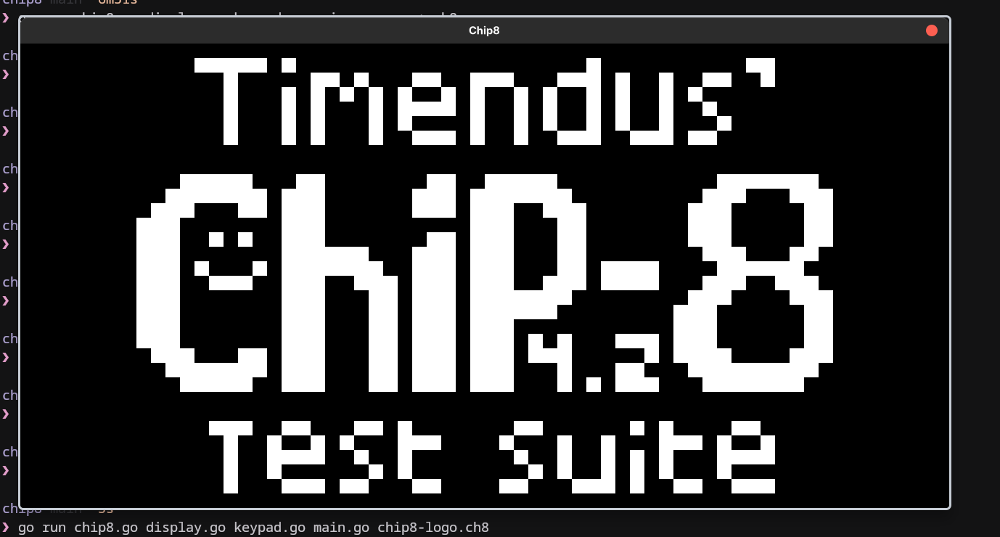
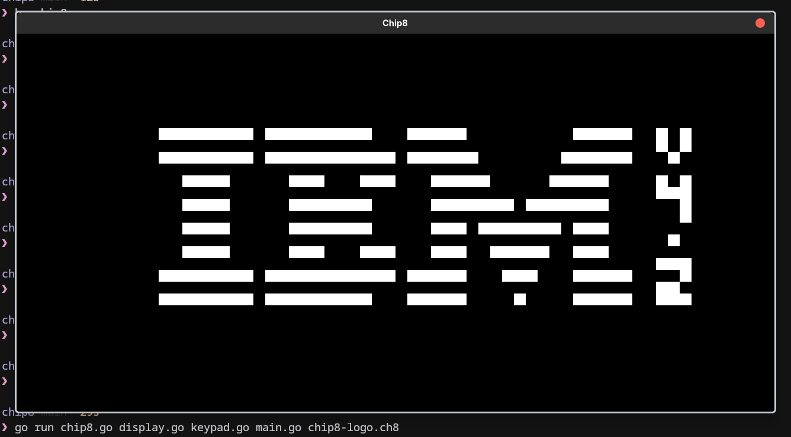
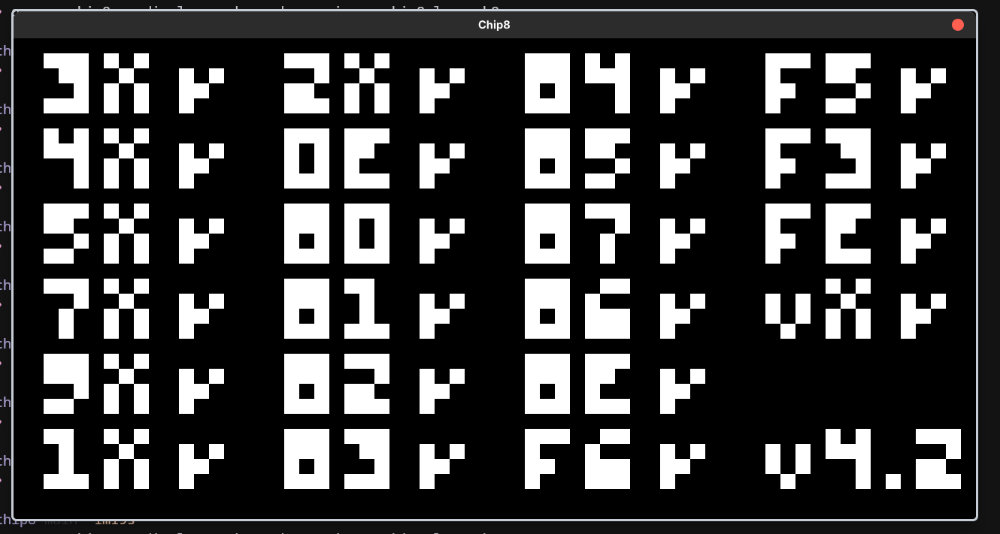
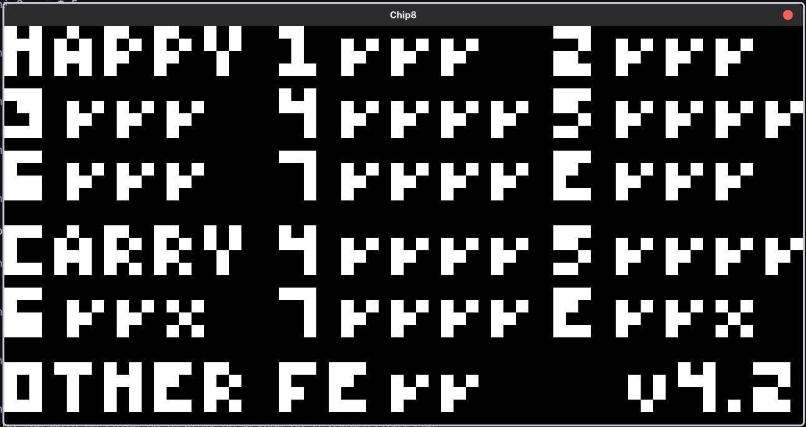

# A chip8 emulator written in Golang


## Running the emulator

### Prerequistes
- go 1.24.4

### Clone the repositry
```bash
git clone https://github.com/rentri/goChip8.git
```

### Run & Build
```bash
cd goChip8
```
Run without building
```bash
go run . <path-to-rom>
```
OR

Build
```bash
go build -o chip8
```
Then run
```bash
./chip8 <path-to-rom>
```

## Tests Passed

  - [X] Chip-8 Splash Screen
  
  
  - [X] IBM LOGO
  
  
  
    
  - [X] CORAX+ opcode test
  
  
  
  - [X] Flags test
    > [!NOTE]
    > Our implementation of SHR and SHL instructions uses modern beavior.
    > Hence 8XY6 & 8XYE fail the last check.
  
  
  
  - [ ] Quirks test
  - [ ] Keypad test

## TODO
<details>

- [x] Implement a Chip8 interfcae
- [x] Handle graphics
- [x] Implement Keypad
  - [ ] Implement Scancodes
- [ ] Sound Support
- [x] Add and Load Fonts
- [x] Implement Timers
- [x] Decode Instruction

<details>
<summary>Implemented Instructions</summary>

- [x] Implement instructions
  - [x] `00E0` clear screen
  - [x] `00EE` return from subroutine

  - [x] `1NNN` jump
  - [x] `2NNN` call subroutine

  - [x] `3XNN` skip if `VX == NN`
  - [x] `4XNN` skip if `VX != NN`
  - [x] `5XY0` skip if `VX == VY`

  - [x] `6XNN` set register `VX`
  - [x] `7XNN` add value to register `VX`

  - [x] `8XY0` set `VX = VY`
  - [x] `8XY1` set `VX = VX OR VY`
  - [x] `8XY2` set `VX = VX AND VY`
  - [x] `8XY3` set `VX = VX XOR VY`
  - [x] `8XY4` add `VY` to `VX` (set VF = carry)
  - [x] `8XY5` subtract `VY` from `VX` (set VF = NOT borrow)
  - [x] `8XY6` shift `VX` right (VF = LSB)
  - [x] `8XY7` set `VX = VY - VX` (set VF = NOT borrow)
  - [x] `8XYE` shift `VX` left (VF = MSB)

  - [x] `9XY0` skip if `VX != VY`

  - [x] `ANNN` set index register `I`
  - [x] `BNNN` jump to `NNN + V0`

  - [x] `CXNN` set `VX = random AND NN`

  - [x] `DXYN` draw

  - [x] `EX9E` skip if key in `VX` is pressed
  - [x] `EXA1` skip if key in `VX` is NOT pressed

  - [x] `FX07` set `VX = delay timer`
  - [x] `FX0A` wait for key press, store in `VX`
  - [x] `FX15` set delay timer = `VX`
  - [x] `FX18` set sound timer = `VX`
  - [x] `FX1E` add `VX` to `I`
  - [x] `FX29` set `I` to sprite location for digit `VX`
  - [x] `FX33` store BCD of `VX` in memory
  - [x] `FX55` store registers `V0` to `VX` in memory
  - [x] `FX65` load registers `V0` to `VX` from memory
  </details>
</details>

# Resources
http://devernay.free.fr/hacks/chip8/C8TECH10.HTM
